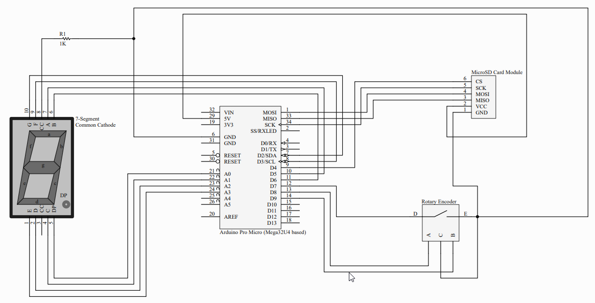

# PasswordHelper
Simple USB password helper (auto typer), ! not safe don't use !

## Usage:

### Recorder:

- Using the recorder program select the sd card.
- Insert the device unique code.
- If there's already data on sd card, insert the PIN code.
- If there's no data on sd card, create a new PIN code.
- Select the position to store the password (0 to 9).

The passwords will be encrypted using the 4 digits PIN code.

### Device:

- The display will show a dot if the device it's locked.
- Dial the 4 digit PIN code to unlock (clicking to select each number).
- Dial the desired password and click.
- If there's a password on the selected position it will be typed followed by an enter.
- After 60 seconds the display will turn of, but the device will remain unlocked.
- To lock the device unplug from USB.

## Hardware:

### Material list:

- Arduino Pro Micro (or any mega32U4 based arduino).
- 7-segments display (common cathode).
- SD card reader SPI module.
- Rotary encoder with push button.
- 1k Resistor.

### Circuit Schema:

## Extra Arduino Libraries:

[ClickEncoder.h](https://github.com/0xPIT/encoder/tree/arduino)

[TimerOne.h](http://playground.arduino.cc/Code/Timer1)
